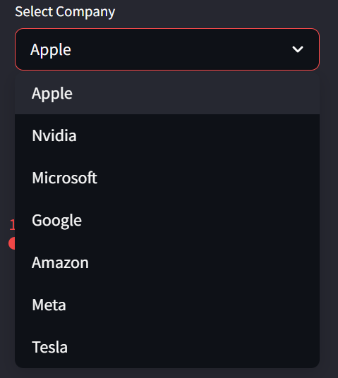
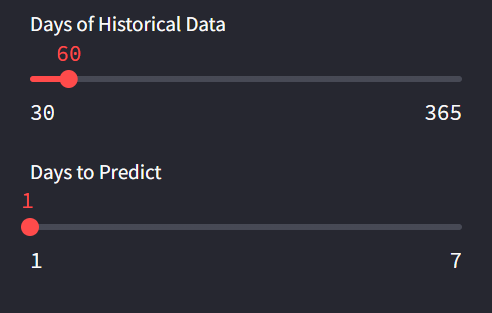
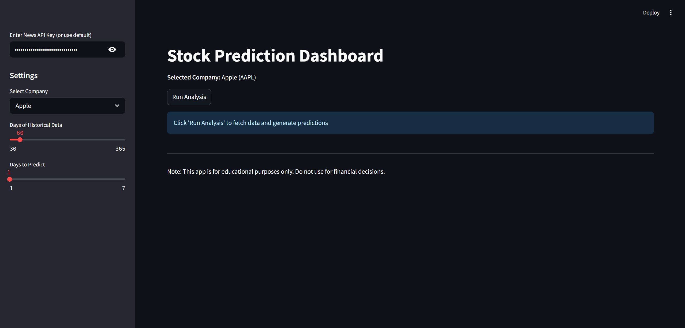
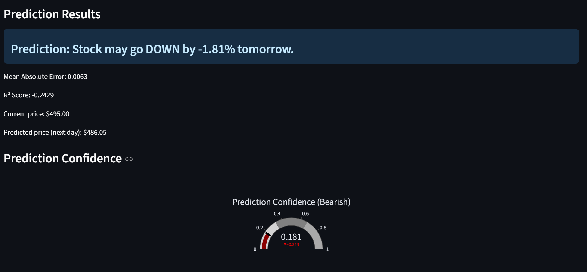
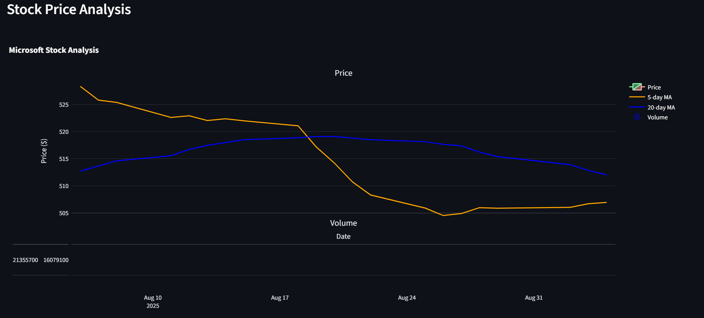
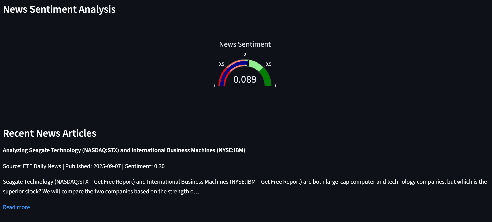
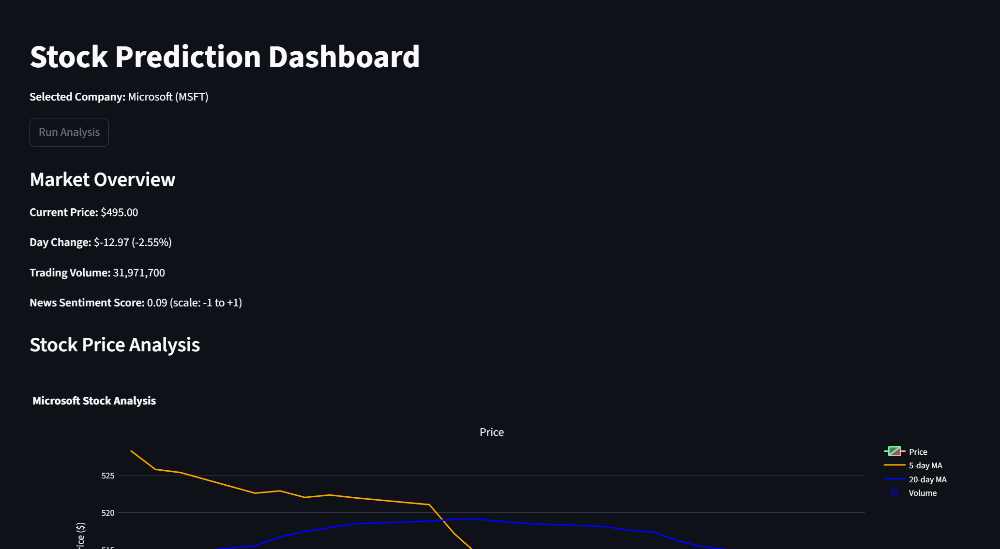

# Stock Prediction Dashboard

A comprehensive stock analysis and prediction application built with Streamlit that combines technical analysis with news sentiment analysis to predict stock price movements.



## 🚀 Features

- **Real-time Stock Data**: Fetches live stock data using Yahoo Finance API
- **News Sentiment Analysis**: Analyzes recent news articles to gauge market sentiment
- **Machine Learning Predictions**: Uses Random Forest Regression for price movement predictions
- **Interactive Visualizations**: Beautiful charts and gauges using Plotly and Matplotlib
- **Technical Indicators**: Includes RSI, moving averages, and other technical analysis tools
- **Multi-company Support**: Supports major tech stocks (Apple, NVIDIA, Microsoft, Google, Amazon, Meta, Tesla)



## 📋 Table of Contents

- [Installation](#installation)
- [Usage](#usage)
- [Code Structure](#code-structure)
- [Features Explained](#features-explained)
- [API Keys](#api-keys)
- [Screenshots](#screenshots)
- [Dependencies](#dependencies)
- [Contributing](#contributing)
- [Disclaimer](#disclaimer)

## 🛠 Installation

1. **Clone the repository**:
   ```bash
   git clone https://github.com/lokeegit/News-Sentiment-Analyses---Stock-Predictions.git
   cd News-Sentiment-Analyses---Stock-Predictions
   ```

2. **Create a virtual environment**:
   ```bash
   python -m venv stock_env
   source stock_env/bin/activate  # On Windows: stock_env\Scripts\activate
   ```

3. **Install required packages**:
   ```bash
   pip install streamlit yfinance newsapi-python scikit-learn textblob pandas numpy plotly matplotlib
   ```

4. **Get a News API key**:
   - Visit [NewsAPI.org](https://newsapi.org/)
   - Sign up for a free account
   - Get your API key

## 🎯 Usage

1. **Run the application**:
   ```bash
   streamlit run v3.py
   ```

2. **Open your browser** and navigate to `http://localhost:8501`

3. **Configure settings**:
   - Enter your News API key in the sidebar
   - Select a company from the dropdown
   - Adjust the number of days for historical data
   - Set prediction timeframe

4. **Click "Run Analysis"** to generate predictions



## 🏗 Code Structure

### Main Components

#### 1. **Configuration and Setup**
```python
st.set_page_config(page_title="Stock Prediction App", layout="wide")
st.title("Stock Prediction Dashboard")
```
- Sets up the Streamlit page configuration
- Creates a wide layout for better data visualization

#### 2. **Company-Ticker Mapping**
```python
company_ticker_map = {
    'apple': 'AAPL',
    'nvidia': 'NVDA',
    'microsoft': 'MSFT',
    # ... more companies
}
```
- Maps user-friendly company names to stock ticker symbols
- Makes the interface more intuitive for users

#### 3. **Data Fetching Functions**

**Stock Data Fetching**:
```python
def fetch_stock_data(ticker, days):
    end = datetime.datetime.now()
    start = end - datetime.timedelta(days=days)
    df = yf.download(ticker, start=start, end=end)
    return df
```
- Uses Yahoo Finance API to fetch historical stock data
- Retrieves OHLCV (Open, High, Low, Close, Volume) data

**News Sentiment Analysis**:
```python
def get_latest_news_sentiment(company_name):
    try:
        articles = newsapi.get_everything(q=company_name, language='en', sort_by='publishedAt', page_size=5)
        sentiments = []
        news_data = []
        
        for article in articles['articles']:
            content = article['title'] + '. ' + article.get('description', '')
            sentiment = TextBlob(content).sentiment.polarity
            sentiments.append(sentiment)
            # ... process article data
    except Exception as e:
        st.error(f"News API error: {e}")
        return [0], []  # Neutral sentiment fallback
```
- Fetches recent news articles using NewsAPI
- Analyzes sentiment using TextBlob's natural language processing
- Returns sentiment scores (-1 to +1) and article metadata

#### 4. **Data Preparation and Feature Engineering**

```python
def prepare_data(df, sentiments):
    sentiment_avg = np.mean(sentiments) if sentiments else 0
    df = df.copy()
    df['Sentiment'] = sentiment_avg
    df['Return'] = df['Close'].pct_change().shift(-1)  # Target variable
    df['High_Low_Spread'] = df['High'] - df['Low']      # Volatility indicator
    df['Price_Diff'] = df['Close'] - df['Open']         # Daily price change
    df['Volume_Change'] = df['Volume'].pct_change()     # Volume momentum
    
    # Technical indicators
    df['SMA_5'] = df['Close'].rolling(window=5).mean()   # 5-day moving average
    df['SMA_20'] = df['Close'].rolling(window=20).mean() # 20-day moving average
    df['RSI'] = calculate_rsi(df['Close'])               # Relative Strength Index
    
    df.dropna(inplace=True)
    return df
```

**Feature Explanations**:
- **Return**: Next day's percentage change (target variable)
- **High_Low_Spread**: Daily volatility measure
- **Price_Diff**: Intraday price movement
- **Volume_Change**: Trading volume momentum
- **SMA_5/20**: Short and long-term trend indicators
- **RSI**: Momentum oscillator (0-100 scale)

#### 5. **Technical Indicators**

**RSI Calculation**:
```python
def calculate_rsi(prices, period=14):
    delta = prices.diff()
    gain = delta.where(delta > 0, 0)
    loss = -delta.where(delta < 0, 0)
    
    avg_gain = gain.rolling(window=period).mean()
    avg_loss = loss.rolling(window=period).mean()
    
    rs = avg_gain / avg_loss
    rsi = 100 - (100 / (1 + rs))
    return rsi
```
- Calculates Relative Strength Index
- Measures momentum and identifies overbought/oversold conditions
- Values above 70 indicate overbought, below 30 indicate oversold

#### 6. **Machine Learning Model**

```python
def train_prediction_model(df):
    features = ['High_Low_Spread', 'Price_Diff', 'Volume_Change', 'Sentiment']
    X = df[features]
    y = df['Return']
    
    X_train, X_test, y_train, y_test = train_test_split(X, y, test_size=0.2, random_state=42)
    
    model = RandomForestRegressor(n_estimators=200, random_state=42)
    model.fit(X_train, y_train)
    
    predictions = model.predict(X_test)
    
    # Calculate metrics
    mae = mean_absolute_error(y_test, predictions)
    r2 = r2_score(y_test, predictions)
    
    return model, X_test, y_test, predictions, mae, r2, feature_importance
```

**Model Details**:
- **Algorithm**: Random Forest Regression
- **Features**: 4 engineered features combining technical and sentiment data
- **Target**: Next day's percentage return
- **Validation**: 80/20 train-test split
- **Metrics**: Mean Absolute Error (MAE) and R-squared



#### 7. **Visualization Functions**

**Stock Price Chart**:
```python
def create_price_chart(df):
    fig = make_subplots(rows=2, cols=1, shared_xaxes=True, 
                       vertical_spacing=0.03, subplot_titles=('Price', 'Volume'),
                       row_heights=[0.7, 0.3])
    
    # Candlestick chart
    fig.add_trace(go.Candlestick(...), row=1, col=1)
    
    # Moving averages
    fig.add_trace(go.Scatter(...), row=1, col=1)  # 5-day MA
    fig.add_trace(go.Scatter(...), row=1, col=1)  # 20-day MA
    
    # Volume bars
    fig.add_trace(go.Bar(...), row=2, col=1)
```
- Creates interactive candlestick charts
- Overlays moving averages for trend analysis
- Includes volume subplot for trading activity analysis



**Sentiment and Confidence Gauges**:
```python
def create_sentiment_gauge(sentiment_avg):
    fig = go.Figure(go.Indicator(
        mode="gauge+number",
        value=sentiment_avg,
        domain={'x': [0, 1], 'y': [0, 1]},
        title={'text': "News Sentiment"},
        gauge={
            'axis': {'range': [-1, 1]},
            'steps': [
                {'range': [-1, -0.5], 'color': "red"},      # Very negative
                {'range': [-0.5, 0], 'color': "salmon"},    # Negative
                {'range': [0, 0.5], 'color': "lightgreen"}, # Positive
                {'range': [0.5, 1], 'color': "green"}       # Very positive
            ]
        }
    ))
```
- Visual representation of news sentiment
- Color-coded ranges for easy interpretation
- Real-time updates based on latest news



## 🎨 Features Explained

### 1. **Real-time Data Integration**
- **Yahoo Finance**: Provides reliable, real-time stock data
- **NewsAPI**: Fetches latest news articles for sentiment analysis
- **Automatic Updates**: Data refreshes on each analysis run

### 2. **Sentiment Analysis Pipeline**
- **Text Processing**: Combines article titles and descriptions
- **Sentiment Scoring**: Uses TextBlob's pre-trained models
- **Aggregation**: Averages sentiment across multiple articles
- **Integration**: Incorporates sentiment as a model feature

### 3. **Technical Analysis**
- **Moving Averages**: Trend identification and crossover signals
- **RSI**: Momentum oscillator for overbought/oversold conditions
- **Volume Analysis**: Trading activity and market interest
- **Price Action**: Support/resistance and breakout patterns

### 4. **Machine Learning Approach**
- **Feature Engineering**: Creates meaningful predictors from raw data
- **Ensemble Method**: Random Forest reduces overfitting
- **Cross-validation**: Ensures model generalizability
- **Performance Metrics**: Quantifies prediction accuracy

### 5. **Interactive Dashboard**
- **User Controls**: Customizable time periods and companies
- **Real-time Charts**: Interactive Plotly visualizations
- **Progress Indicators**: User-friendly loading states
- **Error Handling**: Graceful failure management



## 🔑 API Keys

### NewsAPI Configuration
1. **Free Tier**: 500 requests/day, 100 requests/hour
2. **Rate Limits**: Built-in error handling for exceeded limits
3. **Fallback**: Neutral sentiment (0) when API fails
4. **Security**: API key input field with password masking

### Default API Key
The code includes a default API key for demonstration purposes:
```python
api_key = st.sidebar.text_input("Enter News API Key (or use default)", 
                                value='19671c9a98d54cb5a545c6fbaa7984bd', 
                                type="password")
```
**Note**: Replace with your own API key for production use.

## 📊 Model Performance

### Evaluation Metrics
- **Mean Absolute Error (MAE)**: Average prediction error
- **R-squared (R²)**: Variance explained by the model
- **Feature Importance**: Contribution of each feature to predictions

### Feature Importance Ranking
1. **Sentiment**: News sentiment impact on price
2. **Volume_Change**: Trading activity momentum
3. **Price_Diff**: Intraday price movement
4. **High_Low_Spread**: Daily volatility measure

## 🎯 Supported Companies

| Company | Ticker | Sector |
|---------|--------|---------|
| Apple | AAPL | Technology |
| NVIDIA | NVDA | Technology |
| Microsoft | MSFT | Technology |
| Google | GOOGL | Technology |
| Amazon | AMZN | E-commerce |
| Meta | META | Social Media |
| Tesla | TSLA | Automotive |

## 📱 User Interface

### Sidebar Controls
- **Company Selection**: Dropdown with major tech stocks
- **Historical Data**: 30-365 days range
- **Prediction Period**: 1-7 days forecast
- **API Key Input**: Secure key management

### Main Dashboard
- **Market Overview**: Current price, change, volume
- **Stock Charts**: Candlestick with technical indicators
- **Prediction Results**: Direction, percentage, confidence
- **News Analysis**: Sentiment gauge and article summaries

## 🔧 Dependencies

```txt
streamlit>=1.28.0
yfinance>=0.2.18
newsapi-python>=0.2.6
scikit-learn>=1.3.0
textblob>=0.17.1
pandas>=2.0.0
numpy>=1.24.0
plotly>=5.15.0
matplotlib>=3.7.0
```

## 🚦 Getting Started

### Quick Start
1. Clone the repository
2. Install dependencies: `pip install -r requirements.txt`
3. Get NewsAPI key from newsapi.org
4. Run: `streamlit run v3.py`
5. Open browser to localhost:8501

### Configuration Tips
- **Historical Data**: More data (60+ days) improves model accuracy
- **News Sentiment**: Recent articles (last 24 hours) are most relevant
- **Prediction Period**: Shorter periods (1-2 days) are more reliable
- **API Limits**: Monitor NewsAPI usage to avoid rate limiting

## 📈 How Predictions Work

### 1. **Data Collection**
```python
# Stock data: OHLCV prices
df_stock = fetch_stock_data(ticker, days_to_fetch)

# News sentiment: Article analysis
sentiments, news_data = get_latest_news_sentiment(company_name)
```

### 2. **Feature Engineering**
```python
# Technical features
df['High_Low_Spread'] = df['High'] - df['Low']
df['Price_Diff'] = df['Close'] - df['Open']
df['Volume_Change'] = df['Volume'].pct_change()

# Sentiment feature
df['Sentiment'] = sentiment_avg
```

### 3. **Model Training**
```python
# Random Forest with 200 trees
model = RandomForestRegressor(n_estimators=200, random_state=42)
model.fit(X_train, y_train)
```

### 4. **Prediction Generation**
```python
# Latest feature values
latest_features = df_prepared[features].iloc[-1].values.reshape(1, -1)

# Percentage change prediction
predicted_change = model.predict(latest_features)[0]

# Price prediction
predicted_price = current_price * (1 + predicted_change)
```

## 📊 Understanding the Output

### Prediction Format
- **Direction**: UP/DOWN based on predicted percentage change
- **Magnitude**: Percentage change expected (e.g., +2.5%)
- **Confidence**: Derived from prediction strength and model accuracy
- **Price Target**: Current price adjusted by predicted change

### Interpreting Sentiment
- **-1.0 to -0.5**: Very negative news sentiment
- **-0.5 to 0.0**: Moderately negative sentiment  
- **0.0 to +0.5**: Moderately positive sentiment
- **+0.5 to +1.0**: Very positive news sentiment

### Model Reliability
- **R² > 0.3**: Good explanatory power
- **MAE < 0.02**: Low average error (2%)
- **Feature Importance**: Balanced contributions indicate robust model

## 🛡 Error Handling

### API Failures
```python
try:
    articles = newsapi.get_everything(...)
except Exception as e:
    st.error(f"News API error: {e}")
    return [0], []  # Neutral sentiment fallback
```

### Data Quality Checks
```python
if not df_stock.empty and len(df_stock) >= 2:
    # Proceed with analysis
else:
    st.error("Could not retrieve enough price data.")
    st.stop()
```

### User Input Validation
- **Date Ranges**: Ensures sufficient historical data
- **API Keys**: Validates format and availability
- **Company Selection**: Restricts to supported tickers

## 🎨 Customization Options

### Adding New Companies
```python
company_ticker_map = {
    'apple': 'AAPL',
    'your_company': 'TICKER',  # Add here
    # ... existing companies
}
```

### Modifying Features
```python
# Add new technical indicators
df['MACD'] = calculate_macd(df['Close'])
df['Bollinger'] = calculate_bollinger_bands(df['Close'])

# Update feature list
features = ['High_Low_Spread', 'Price_Diff', 'Volume_Change', 'Sentiment', 'MACD', 'Bollinger']
```

### Adjusting Model Parameters
```python
# Tune Random Forest parameters
model = RandomForestRegressor(
    n_estimators=500,      # More trees
    max_depth=10,          # Limit depth
    min_samples_split=5,   # Minimum samples per split
    random_state=42
)
```

## 🔬 Advanced Features

### Model Interpretability
- **Feature Importance**: Shows which factors most influence predictions
- **Prediction Confidence**: Gauges reliability of individual predictions
- **Historical Performance**: Tracks model accuracy over time

### Technical Analysis Integration
- **Multiple Timeframes**: 5-day and 20-day moving averages
- **Momentum Indicators**: RSI for overbought/oversold signals  
- **Volume Analysis**: Confirms price movements with trading activity

### Sentiment Analysis Enhancement
- **Multi-source News**: Aggregates from various reliable sources
- **Temporal Weighting**: Recent news has higher impact
- **Keyword Filtering**: Focuses on company-specific news

## 📚 Educational Value

### Learning Objectives
1. **Financial Analysis**: Understanding stock market indicators
2. **Machine Learning**: Practical application of regression models
3. **Data Visualization**: Creating meaningful charts and dashboards
4. **API Integration**: Working with financial and news APIs
5. **Sentiment Analysis**: Natural language processing applications

### Key Concepts Demonstrated
- **Feature Engineering**: Creating predictive variables from raw data
- **Model Validation**: Proper train/test splitting and metrics
- **Real-time Data**: Handling live data streams and updates
- **User Interface Design**: Building intuitive dashboards

## ⚠️ Important Disclaimers

### Financial Disclaimer
- **Educational Purpose**: This application is for learning and demonstration only
- **Not Financial Advice**: Do not use predictions for actual trading decisions  
- **Market Risks**: Stock markets are inherently unpredictable and risky
- **Model Limitations**: Past performance does not guarantee future results

### Technical Limitations
- **Prediction Accuracy**: Models cannot predict market crashes or unexpected events
- **Data Dependencies**: Requires reliable internet connection and API access
- **Sample Size**: Short-term predictions are less reliable than long-term trends
- **Market Hours**: Real-time data only available during trading hours

## 🤝 Contributing

### Development Setup
1. Fork the repository
2. Create a feature branch: `git checkout -b feature-name`
3. Make your changes and test thoroughly
4. Submit a pull request with detailed description

### Contribution Guidelines
- **Code Style**: Follow PEP 8 Python style guide
- **Documentation**: Update README for new features
- **Testing**: Ensure all functions work with sample data
- **Performance**: Optimize for speed and memory usage

### Feature Requests
- **New Indicators**: Additional technical analysis tools
- **More Companies**: Expand beyond current tech stocks
- **Enhanced UI**: Improved visualizations and interactions
- **Export Features**: Save predictions and charts

## 📞 Support

### Common Issues
1. **API Key Errors**: Verify NewsAPI key is valid and has remaining quota
2. **Import Errors**: Ensure all dependencies are installed correctly
3. **Data Issues**: Check internet connection and Yahoo Finance availability
4. **Performance**: Reduce historical data range for faster loading

### Getting Help
- **GitHub Issues**: Report bugs and feature requests
- **Documentation**: Refer to this comprehensive README
- **Community**: Join discussions in the repository

## 📄 License

This project is open source and available under the MIT License. See LICENSE file for details.

---

**Repository**: https://github.com/lokeegit/News-Sentiment-Analyses---Stock-Predictions.git

**Last Updated**: September 2025

**Version**: 3.0
